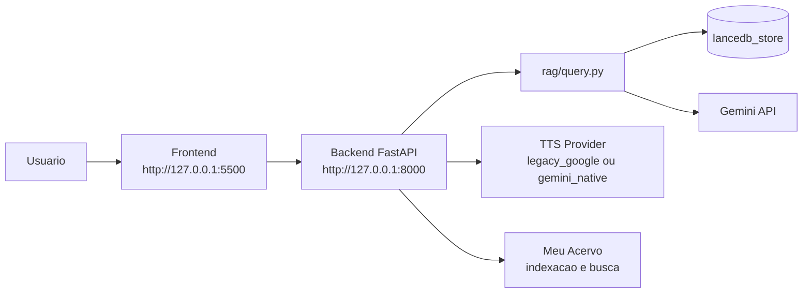
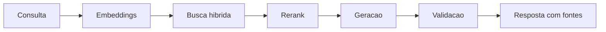

# Ratio - Pesquisa Jurisprudencial

Assistente juridico local para pesquisa de jurisprudencia STF/STJ, com suporte a:
- busca hibrida (semantica + lexical),
- rerank juridico,
- geracao de resposta com citacoes,
- TTS,
- indexacao de documentos do usuario em "Meu Acervo".

---

## Visao geral rapida

### Arquitetura



### Pipeline de consulta



### Dois modos de uso

1. Usuario final (recomendado): executa `Ratio.exe` a partir da pasta `dist\Ratio\`.
2. Desenvolvimento: roda backend/frontend manualmente com Python.

Download do pacote Windows:
<https://drive.google.com/file/d/1fHNvcpugTT9b2y2C1F193HefmxhO9hmM/view?usp=sharing>

Versao da landing page: 27/02/2026

---

## O que este pacote contem

- API backend (`backend/`)
- Frontend web (`frontend/`)
- Motor de busca e ranking (`rag/query.py`)
- Scripts de inicializacao/encerramento para Windows
- Testes e CI

## O que nao esta incluso

- Pipelines de scraping bruto STF/STJ
- Datasets brutos muito grandes (`data/`)
- Logs de execucao e arquivos temporarios locais

---

## Requisitos

### Para desenvolvimento

- Python 3.10+
- Chave Gemini (`GEMINI_API_KEY`)
- Internet para primeira carga de modelos locais (reranker)

Instalacao:

```bash
py -m pip install -r requirements.txt
```

### Para usuario final (executavel)

- Windows 10/11
- Pasta `dist\Ratio\` completa (nao apenas o `.exe`)
- Chave Gemini configurada no onboarding ou via `.env`

---

## Build executavel .exe (Windows)

Use o script:

```text
build_windows_exe.bat
```

O script prioriza `Python 3.12` (via `py -3.12`) e usa `py` como fallback.

Ao final, o executavel fica em:

```text
dist\Ratio\Ratio.exe
```

No computador final, o usuario nao precisa de Python instalado.
O build inclui `lancedb_store` em `dist\Ratio\` e gera backup preventivo de banco em `build\database_backups\` quando aplicavel.

### Distribuicao recomendada

1. Compactar e enviar a pasta inteira `dist\Ratio\`.
2. Manter estrutura interna intacta (`_internal`, `lancedb_store`, `logs`).
3. Usuario final executa apenas `Ratio.exe`.

---

## Primeiro uso (usuario final)

1. Extraia o ZIP para uma pasta local, por exemplo `C:\Ratio`.
2. Execute `Ratio.exe`.
3. Aguarde abrir no navegador `http://127.0.0.1:5500`.
4. No modal inicial, informe a chave Gemini.
5. Rode uma consulta de teste.

### Diagnostico rapido

| Sintoma | Causa comum | Acao |
|---|---|---|
| `Failed to fetch` no frontend | backend local nao iniciou | rodar `Ratio.exe` via terminal e verificar erros |
| `http://127.0.0.1:8000/health` nao abre | porta 8000 bloqueada/ocupada ou backend caiu | checar firewall/antivirus/processo em 8000 |
| travado em `Loading reranker model...` no primeiro uso | download/carga inicial do modelo local | aguardar; nas proximas consultas tende a ser bem mais rapido |

---

## Configuracao de ambiente (dev)

1. Copie `.env.example` para `.env`.
2. Configure no minimo:

```text
GEMINI_API_KEY=...
```

---

## TTS (provedor configuravel)

O endpoint `/api/tts` suporta dois provedores:

- `legacy_google` (padrao): Google Cloud Text-to-Speech (`texttospeech.googleapis.com`) com voz Neural2.
- `gemini_native`: caminho Gemini nativo (mantido como alternativa).

Perfil padrao estavel:

```text
TTS_PROVIDER=legacy_google
GOOGLE_TTS_VOICE_NAME=pt-BR-Neural2-B
TTS_LANGUAGE_CODE=pt-BR
GOOGLE_TTS_MAX_CHARS=5000
GOOGLE_TTS_REQUEST_TIMEOUT_MS=45000
```

Observacoes:
- perfil legado usa `speakingRate=1.2` e `pitch=-4.5`.
- chave usada: `GOOGLE_TTS_API_KEY` ou `GEMINI_API_KEY` (fallback).

Opcional (caminho Gemini):

```text
TTS_PROVIDER=gemini_native
GEMINI_TTS_MODEL=gemini-2.5-flash-preview-tts
GEMINI_TTS_VOICE=charon
GEMINI_TTS_MAX_CHARS=400
GEMINI_TTS_REQUEST_TIMEOUT_MS=120000
GEMINI_TTS_REQUEST_RETRY_ATTEMPTS=1
GEMINI_TTS_MODEL_MAX_ATTEMPTS=2
```

---

## Gemini API onboarding (antes do primeiro uso)

1. Gere sua chave no Google AI Studio: <https://aistudio.google.com/apikey>.
2. Clique em **Create API key** e copie a chave.
3. No projeto, preencha `GEMINI_API_KEY` no arquivo `.env`.
4. Verifique limites ativos da conta:
   - <https://ai.google.dev/gemini-api/docs/rate-limits>
5. Se precisar aumentar limites:
   - <https://ai.google.dev/gemini-api/docs/billing>

---

## Custos de referencia (snapshot 2026-02-24)

Fonte oficial: <https://ai.google.dev/gemini-api/docs/pricing>  
Valores podem mudar. Sempre confirme na tabela oficial.

| Modelo | Cota gratuita | Preco de entrada (1M tokens) | Preco de saida (1M tokens) |
|---|---|---|---|
| `gemini-3-pro-preview` | Nao | US$ 2.00 (<=200k) / US$ 4.00 (>200k) | US$ 12.00 (<=200k) / US$ 18.00 (>200k) |
| `gemini-2.5-flash` | Sim | US$ 0.30 (<=200k) / US$ 0.60 (>200k) | US$ 2.50 (<=200k) / US$ 3.50 (>200k) |
| `gemini-embedding-001` | Sim | US$ 0.15 | N/A |

Notas:
- Limites RPM/TPM/RPD dependem do modelo e tier da conta.
- O Ratio usa embeddings e geracao; monitore consumo antes de lotes grandes.

---

## Pacote de dados obrigatorio

Para consultas reais, o app precisa de indice LanceDB preconstruido.

Caminho esperado na raiz do projeto/pacote:

```text
lancedb_store/
  jurisprudencia.lance/
```

Sem essa pasta, `/api/query` nao retorna resultados.

---

## Acervo (snapshot local)

Snapshot medido em **2026-02-24** sobre `lancedb_store/jurisprudencia`.

### Pegada de armazenamento

| Componente | Tamanho (GB) | Tamanho (GiB) |
|---|---:|---:|
| `data/` (SQLite e ativos locais) | 14.905 GB | 13.882 GiB |
| `lancedb_store/` (indice vetorial + tabelas) | 8.559 GB | 7.971 GiB |
| **Total local** | **23.464 GB** | **21.853 GiB** |

### Tamanho do corpus

- Documentos indexados: **471,366**
- `texto_integral` nao vazio: **471,303**
- Volume total `texto_integral`: **2,507,247,355** caracteres
- Volume total `texto_busca`: **1,738,788,368** caracteres

### Conversao para paginas fisicas (estimativa)

Cenario A (A4 juridico, 2.500 caracteres/pagina):
- **1,002,899** paginas
- **3,343** livros (300 paginas/livro)

Cenario B (layout mais denso, 2.100 caracteres/pagina):
- **1,193,928** paginas
- **3,980** livros (300 paginas/livro)

### Distribuicao por tipo (`texto_integral`)

| Tipo | Documentos | Caracteres | Paginas (2.500 chars/pag) | Livros (300 pag) |
|---|---:|---:|---:|---:|
| `monocratica` | 229,703 | 2,310,119,288 | 924,048 | 3,081 |
| `acordao` | 223,077 | 180,007,985 | 72,004 | 241 |
| `informativo` | 16,300 | 14,894,148 | 5,958 | 20 |
| `sumula` | 736 | 871,622 | 349 | 2 |
| `tema_repetitivo_stj` | 689 | 674,568 | 270 | 1 |
| `sumula_stj` | 641 | 251,481 | 101 | 1 |
| `monocratica_sv` | 112 | 388,580 | 156 | 1 |
| `sumula_vinculante` | 63 | 0 | 0 | 0 |
| `acordao_sv` | 45 | 39,683 | 16 | 1 |

---

## Download do reranker (obrigatorio)

Reranker local padrao:
- `BAAI/bge-reranker-v2-m3`

Ele pode ser baixado/carregado no primeiro uso. Para preaquecer manualmente:

```bash
py -c "from sentence_transformers import CrossEncoder; CrossEncoder('BAAI/bge-reranker-v2-m3')"
```

---

## Como executar a aplicacao

### Scripts Windows (recomendado)

Menu de controle:

```text
controle_jurisai_web.bat
```

Iniciar:

```text
iniciar_jurisai_web.bat
```

Desligar:

```text
desligar_jurisai_web.bat
```

Status:

```text
status_jurisai_web.bat
```

### Modo manual

Backend:

```bash
py -m uvicorn backend.main:app --host 127.0.0.1 --port 8000 --reload
```

Frontend:

```bash
py -m http.server 5500 --directory frontend
```

Abra `http://127.0.0.1:5500`.

Health check:

```bash
curl http://127.0.0.1:8000/health
```

---

## Fluxo amigavel (ZIP -> consulta -> desligar)

1. Baixe o ZIP e extraia a pasta.
2. Instale dependencias (`py -m pip install -r requirements.txt`) se estiver em modo desenvolvimento.
3. Inicie com `controle_jurisai_web.bat` (opcao 1) ou `iniciar_jurisai_web.bat`.
4. No primeiro acesso, configure a chave Gemini no onboarding.
5. Ajuste modelos/pesos e clique em **Salvar ajustes**.
6. Faça as consultas.
7. Para encerrar, use `controle_jurisai_web.bat` (opcao 2) ou `desligar_jurisai_web.bat`.

---

## Erros comuns e significado

| Codigo | Significado | Acao recomendada |
|---|---|---|
| `missing_api_key` | Chave Gemini ausente | Configurar chave no modal inicial ou `.env` |
| `invalid_api_key` | Chave invalida | Gerar nova chave no AI Studio e colar novamente |
| `api_key_not_active` | API/chave sem permissao ativa | Ativar Gemini API no projeto Google Cloud vinculado |
| `quota_exhausted` | Cota gratuita/paga esgotada | Aguardar reset da cota ou ajustar billing/limites |
| `rate_limited` | Excesso de requisicoes por minuto | Reduzir frequencia/paralelismo |
| `model_unavailable` | Modelo indisponivel para a conta | Trocar modelo nas configuracoes |
| `upstream_unavailable` | Instabilidade temporaria do provedor | Tentar novamente em instantes |

---

## Observabilidade e logs

Principais arquivos de runtime:
- `logs/runtime/acervo_backend.log`
- `logs/runtime/tts_backend.log`
- `logs/runtime/meu_acervo_manifest.json`

Arquivos de build:
- `build/Ratio/warn-Ratio.txt`
- `build/Ratio/xref-Ratio.html`

---

## Testes

Suite completa:

```bash
py -m pytest
```

Suite principal do contrato/API/frontend:

```bash
py -m pytest -q tests/test_api_contract.py tests/test_frontend_sidebar_saved.py tests/test_packaging_support.py
```

---

## Notas de codigo aberto

- Nao versione `.env` ou chaves de API.
- Consulte tambem:
  - `CONTRIBUTING.md`
  - `CODE_OF_CONDUCT.md`
  - `SECURITY.md`
  - `LICENSE`

---

## Apoio ao projeto

Se o Ratio for util no seu fluxo de pesquisa, seu apoio ajuda a manter e evoluir a plataforma.

- GitHub Sponsors: <https://github.com/sponsors/carlosvictorodrigues>
- Instagram: `@carlosvictorodrigues`
- E-mail: `contato@ratiojuris.me`
- PIX (copia e cola):

```text
00020126920014BR.GOV.BCB.PIX013607cdc77f-cd4b-44b8-a910-a254f58642f40230Apoie o Ratio - Jurisprudencia5204000053039865802BR5925Carlos Victor de Oliveira6009SAO PAULO621405102qCvdJp89F6304E670
```

O QR Code de apoio tambem esta na interface (modal "Sobre o Ratio", aba "Autor").

---

## Aviso legal

O Ratio e um assistente de pesquisa.
Nao substitui consultoria juridica formal.
Sempre valide fontes primarias antes de decidir estrategicamente.
